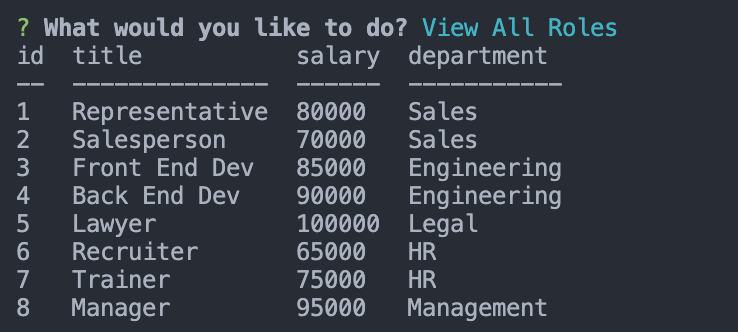

# Company Viewer 
## Description 
Company viewer is a terminal based application that helps you view and manage your company employees, departments, and roles. This application utilizes SQL to help you store and movde data inside a database. By typing node index you are prompted with a list detailing whether you would like to view departments, roles, or employees and an option to add new items to each of those. 
## Table of Contents 
* [Home](#home) 
* [Features](#webpage) 
* [Technology](#technology) 
* [Questions](#questions) 
## Home 
Type node index in the terminal and a home prompt will be shown.
 
User can then use the arrow keys to navigate between the prompt. 
Viewing departments will bring up a department table. 
 
Viewing roles will bring up a role table displaying title, salary, and department.
 
Viewing employees will bring up an employee table displaying first and last name, title, salary, department, and manager. 
 
## Features 
The app also includes the ability to add to each category.  
Adding an employee will prompt you a series of questions, then create an employee on the employee table. 
 
Adding a role will prompt you a series of questions, then create a role on the role table.
 
Adding a department will prompt you to answer a single question stating the department.
 
## Technology 
Javascript, SQL, NPM, Inquirer, MySQL2(NPM) Console.table(NPM)
## Questions 
GitHub: https://github.com/adambedingfield 
Email: adamcbedingfield@gmail.com 